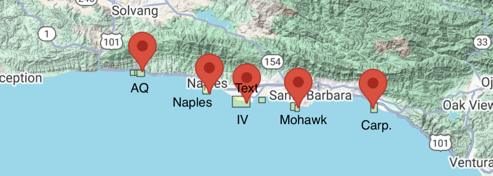

# Lobsters between MPA and Non-MPA Sites

## California Spiny Lobster Abundance (*Panulirus Interruptus*)

### Assessing the Impact of Marine Protected Areas (MPAs) at 5 Reef Sites in Santa Barbara County

### "EDS 241 / ESM 244"

### date: "1/8/2026 (Due 1/17)"

------------------------------------------------------------------------

------------------------------------------------------------------------

#### DATA SOURCE:

Reed D. 2019. SBC LTER: Reef: Abundance, size and fishing effort for California Spiny Lobster (Panulirus interruptus), ongoing since 2012. Environmental Data Initiative. https://doi.org/10.6073/pasta/a593a675d644fdefb736750b291579a0. Dataset accessed 11/17/2019.

------------------------------------------------------------------------

### Introduction

Diving into data collected from five reef sites in Santa Barbara County, all about the abundance of California spiny lobsters! 🦞 Data was gathered by divers annually from 2012 to 2018 across Naples, Mohawk, Isla Vista, Carpinteria, and Arroyo Quemado reefs.

Why lobsters? Well, this sample provides an opportunity to evaluate the impact of Marine Protected Areas (MPAs) established on January 1, 2012 (Reed, 2019). Of these five reefs, Naples, and Isla Vista are MPAs, while the other three are not protected (non-MPAs). Comparing lobster health between these protected and non-protected areas gives us the chance to study how commercial and recreational fishing might impact these ecosystems.

We will consider the MPA sites the `treatment` group and use regression methods to explore whether protecting these reefs really makes a difference compared to non-MPA sites (our control group). In this assignment, we’ll think deeply about which causal inference assumptions hold up under the research design and identify where they fall short. 

Let’s break it down step by step and see what the data reveals! 📊

